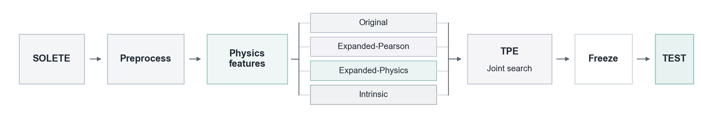
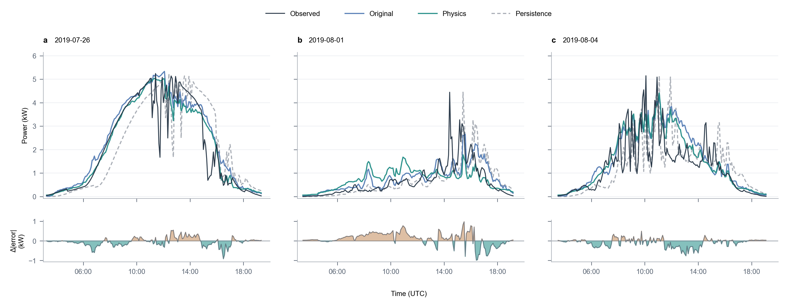

# PhysPV

**Physics guided feature space design for short-term photovoltaic power forecasting.**

[](requirements.txt)
[](LICENSE)

PhysPV compares four independently optimized feature spaces for XGBoost and CNN_LSTM on [SOLETE](https://doi.org/10.11583/DTU.17040767), with Persistence as a baseline.

Physics defines the search space, TPE jointly selects features, history length and model parameters. Configurations are selected on TRAIN/VAL and frozen before TEST.

[Background](#background) · [Model choice](#model-choice) · [Experiment design](#experiment-design) · [Results](#results) · [Quick start](#quick-start) · [License](#license)

## Background

PV operators collect weather, SCADA, equipment and power data, but deciding which inputs improve forecasting remains difficult. PhysPV tests whether physical knowledge can guide feature-space design and improve generalization.

## Model choice

- **XGBoost:** efficient nonlinear modeling of tabular inputs, with a practical precedent for boosted trees in [Open Climate Fix's Quartz Solar Forecast](https://github.com/openclimatefix/open-source-quartz-solar-forecast).
- **CNN_LSTM:** combines short-term fluctuation extraction with temporal memory, motivated by a [2026 two-site PV study](https://doi.org/10.1007/s00521-026-12335-1) evaluating probabilistic forecasts under varied sampling and missing-data conditions.

Together, they test the value of physics derived features across tree and sequence models.

## Experiment design

Adapted from [Pombo et al. (2022)](https://doi.org/10.1016/j.egyr.2022.05.006).



Data quality control: sort timestamps, validate five-minute alignment and reject duplicates; mark missing timestamps on a regular grid and exclude incomplete forecast windows. Missing or inconsistent target-power measurements follow declared physics-based correction rules.
| Feature space | Optional inputs |
| --- | --- |
| Original | Temperature, humidity, wind speed/direction, GHI and POA |
| Expanded-Pearson | Expanded candidates with absolute TRAIN correlation ≥ 0.70; humidity retained |
| Expanded-Physics | Humidity, POA, Pac, TempCell and HoursOfDay |
| Intrinsic | None |

Protocol: five-minute data; 60-step forecasts (five hours); chronological 70/20/10 split; `PRE` up to 120 previous samples plus the current sample. Seed 11, 40 attempts per model/space (320 total, including failures), with ten TPE startup attempts per space.

Scaling and Pearson selection use TRAIN only. Common forecast origins and mean per-horizon daylight VAL RMSE determine frozen winners before one TEST evaluation; no retuning. Nighttime history is retained; geometric night is excluded at VAL/TEST target times.

## Results

Physics reduces XGBoost TEST MAE/RMSE by **6.14%/6.06%** versus Original. CNN_LSTM results are pending. Scores average all 60 daylight horizons against the corrected target; nRMSE uses the 10 kW AC rating.

| Feature space | MAE (kW) | RMSE (kW) | nRMSE |
| --- | --- | --- | --- |
| Original | 0.6578 | 1.0151 | 10.15% |
| Pearson | 0.6673 | 1.0184 | 10.18% |
| **Physics** | **0.6175** | **0.9536** | **9.54%** |
| Intrinsic | 0.6570 | 0.9888 | 9.89% |

Pearson/Physics abbreviate Expanded-Pearson/Expanded-Physics. This single-seed XGBoost study used 160 attempts: Original had 30 successful fits, versus 40 in each other space. Results reflect joint configuration selection and physics-dependent target correction.

### Forecast example



60-minute lead, three TEST days chosen by measured-power variability, independently of forecast errors. Observed is raw measured power. Teal error strips favor Physics; brown favors Original. Original performs better on 1 August.

## Quick start

```bash
git clone https://github.com/ankarafelissi/PhysPV.git
cd PhysPV
python -m pip install -r requirements.txt
python -m unittest discover -s tests
python main.py
```

Place `SOLETE_Pombo_5min.h5` in `data/raw/`. Settings: [config/config.yaml](config/config.yaml) and [config/plant.yaml](config/plant.yaml). Add `--evaluate-test` to evaluate after winners freeze. Models, manifests, predictions and figures are saved under `outputs/`.

## Development

Coding and testing were assisted by Claude (DeepSeek V4) and Codex (GPT-6). Agent working guidelines are documented in [AGENTS.md](AGENTS.md).

## License

Original PhysPV code and documentation: [MIT](LICENSE), © 2026 Felix Lan. SOLETE data: [CC BY 4.0](https://creativecommons.org/licenses/by/4.0/). Third-party source materials retain their release-specific licenses and attribution.
